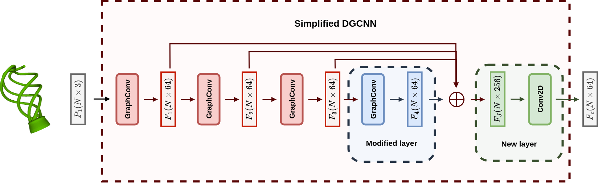
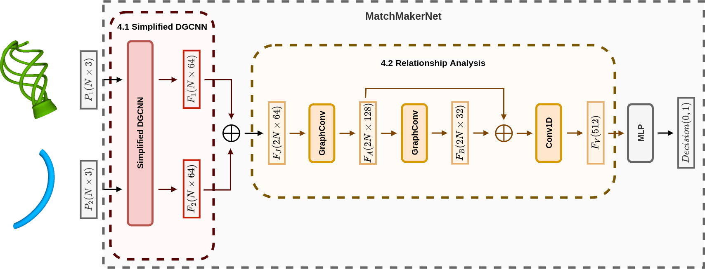

# **Object Reassembly**
Created by Ariana Villegas.

Welcome to the Object Reassembly repository! This repository provides an implementation of an object reassembly pipeline, consisting of two main steps: matching and alignment. In order to perform these steps, a feature extractor is required. To address this, we propose a reduced version of the Dynamic Graph CNN (DGCNN) as our feature extractor. This reduced DGCNN enables efficient and effective feature extraction from point cloud data. Our pipeline encompasses all these steps, allowing for the reassembly of objects from various fragmented parts.

## **Reduced DGCNN**
Our proposed reduced DGCNN is the feature extraction module for the reassembly task. By modifying the last layer to have 64 output channels instead of 128 and introducing a new convolutional layer with 64 output channels, we reduce the number of parameters needed for training and customize the network for our problem.

  

## **MatchMakerNet (MMN)**
Our network architecture for fragment matching utilizes the reduced DGCNN as a feature extractor. It captures meaningful features from input point clouds, which are then processed by graph convolution layers. The concatenated features are fed into an MLP for the final matching decision. This integrated approach combines feature extraction, relationship analysis, and decision-making processes.

  

## **Data Preparation**
+ Reduced DGCNN: Follow instructions in [get_modelnet.md](data/get_modelnet.md).

## **Usage**
### **0. Create environment**
~~~
conda env export > environment.yml
conda activate torch
~~~

### **1. Reduced DGCNN**
#### **1.1 Training**
For training, run:
~~~
python feature_extractor.py --cfg_file=CONFIG_FILE
~~~

#### **1.2 Evaluation**
For evaluation, run:
~~~
python feature_extractor.py --eval=True --cfg_file=CONFIG_FILE --model_path=CHECKPOINT_FILE
~~~

#### **1.3 Help**
For more information about the command-line arguments, run:
~~~
python feature_extractor.py --help
~~~

## License
MIT License

## Acknowledgement
We would like to acknowledge the following repositories for their code contributions, which we have utilized in our project:
+ [PointNet/DGCNN](https://github.com/WangYueFt/dgcnn)
+ [PointNet++](https://github.com/yanx27/Pointnet_Pointnet2_pytorch)
+ [VN_PointNet/VN_DGCNN](https://github.com/FlyingGiraffe/vnn)
